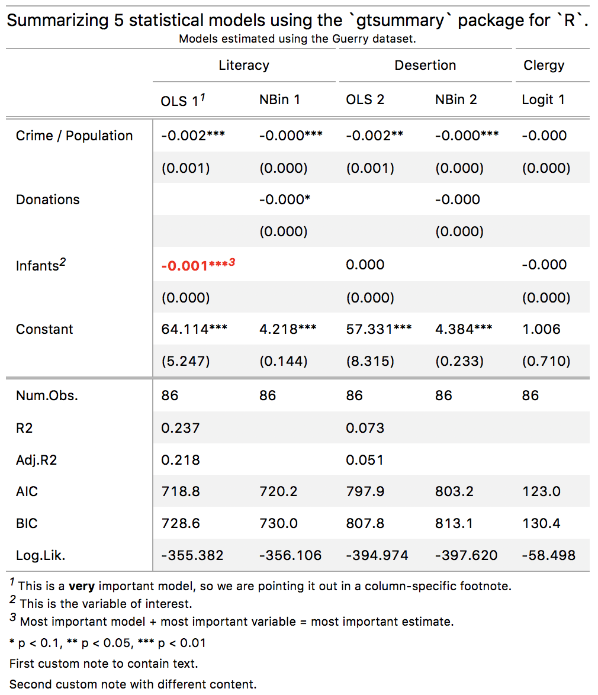
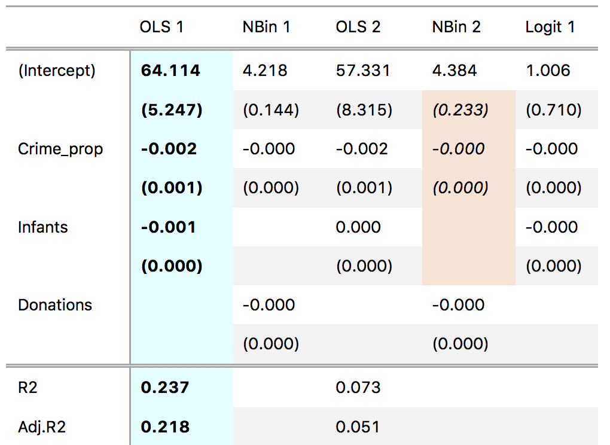

# `gtsummary`

The `gtsummary` package for `R` produces beautiful, customizable, publication-ready tables to summarize statistical models. Results from several models are presented side-by-side, with uncertainty estimates in parentheses (or brackets) underneath coefficient estimates.

Here are a few benefits of `gtsummary` over some [alternative packages](https://github.com/vincentarelbundock/gtsummary#alternative-summary-table-packages-for-r):

* html, rtf, and LaTeX output 
* Excellent integration with:
    - RStudio: When users type `gtsummary(models)`, the summary table immediately appears in RStudio's Viewer window.
    - `knitr`: Dynamic document generation FTW.
    - Designed from the ground up with the `tidy` paradigm in mind.
* Endlessly customizable tables, thanks to the power of the [`gt` package.](https://gt.rstudio.com)
    - In the next section of this README, you will find tables with colored cells, weird text, spanning column labels, row groups, titles and subtitles, footnotes, significance stars, etc. 
* `gtsummary` uses the `broom` package to extract information from model objects. This means that `gtsummary` supports dozens of model types out of the box. Most importantly, `broom` already has a large community of users, and whenever `broom` improves, `gtsummary` improves.
* By using the `broom` and `gt` package for key operations, `gtsummary` has a massively simplified codebase. This should improve long term code maintainability, and allow contributors to participate through GitHub.
* `gtsummary` is developed with unit tests.



# Table of contents

+ [Installation](https://github.com/vincentarelbundock/gtsummary#installation)
+ [Using gtsummary](https://github.com/vincentarelbundock/gtsummary#using-gtsummary)
    * [Preliminaries](https://github.com/vincentarelbundock/gtsummary#preliminaries)
    * [Simple table](https://github.com/vincentarelbundock/gtsummary#simple-table)
    * [SE, p, t, CI](https://github.com/vincentarelbundock/gtsummary#se-t-p-ci)
    * [Output formats](https://github.com/vincentarelbundock/gtsummary#simple-table)
    * [Titles and subtitles](https://github.com/vincentarelbundock/gtsummary#titles-and-subtitles)
    * [Group columns (spanning labels)](https://github.com/vincentarelbundock/gtsummary#column-groups-spanning-labels)
    * [Notes](https://github.com/vincentarelbundock/gtsummary#notes)
    * [Rename, reorder, and subset coefficients](https://github.com/vincentarelbundock/gtsummary#rename-reorder-and-subset-coefficients)
    * [Rename, reorder, and subset goodness-of-fit statistics](https://github.com/vincentarelbundock/gtsummary#rename-reorder-and-subset-goodness-of-fit-statistics)
    * [Stars](https://github.com/vincentarelbundock/gtsummary#stars-statistical-significance-markers)
    * [Digits, rounding, exponential notation](https://github.com/vincentarelbundock/gtsummary#digits-rounding-exponential-notation)
    * [Styles and colors](https://github.com/vincentarelbundock/gtsummary#styles-and-colors)
    * [Fancy text with markdown: bold, italics, etc.](https://github.com/vincentarelbundock/gtsummary#fancy-text-with-markdown-bold-italics-etc)
    * [Add rows manually](https://github.com/vincentarelbundock/gtsummary#add-rows-manually)
    * [Complex table](https://github.com/vincentarelbundock/gtsummary#complex-table)
    * [Power users](https://github.com/vincentarelbundock/gtsummary#power-users)
+ [Alternative summary table packages for R](https://github.com/vincentarelbundock/gtsummary#alternative-summary-table-packages-for-r)

# Installation

The `gt` and `gtsummary` packages are not available on CRAN yet. You can install them from github:

```r
library(remotes)
remotes::install_github('rstudio/gt')
remotes::install_github('vincentarelbundock/gtsummary')
```

Make sure you also install `tidyverse`, as `gtsummary` depends on a lot of its packages (e.g., `stringr`, `dplyr`, `tidyr`, `purrr`):

```r
install.packages('tidyverse')
```

# Using gtsummary

## Preliminaries

Load packages and download some data from the [RDatasets](https://vincentarelbundock.github.io/Rdatasets/) repository. Then, estimate 5 different models and store them in a named list. The name of each model in that list will be used as a column label:

```r
library(gt)
library(MASS)
library(gtsummary)
url <- 'https://vincentarelbundock.github.io/Rdatasets/csv/HistData/Guerry.csv'
dat <- read.csv(url) 
dat$Clergy <- ifelse(dat$Clergy > 40, 1, 0) # binary variable for logit model

models <- list()
models[['OLS 1']] <- lm(Literacy ~ Crime_prop + Infants, dat)
models[['NBin 1']] <- glm.nb(Literacy ~ Crime_prop + Donations, dat)
models[['OLS 2']] <- lm(Desertion ~ Crime_prop + Infants, dat)
models[['NBin 2']] <- glm.nb(Desertion ~ Crime_prop + Donations, dat)
models[['Logit 1']] <- glm(Clergy ~ Crime_prop + Infants, dat, family = binomial())
```

## Simple table

Produce a simple table. 

```r
gtsummary(models)
```

RStudio will render this automatically as an html table. If you do not use RStudio, read the next section to learn how to save to file.

Of course, `gtsummary` can also summarize single models:

```r
mod <- lm(Clergy ~ Crime_prop, data = dat)
gtsummary(mod)
```

## Output formats

To save a table to file, use the `filename` argument. `gtsummary` guesses the output format based on the `filename` extension. The supported extensions are: `.tex`, `.rtf`, `.html` (ASCII/Text tables coming soon).

```r
gtsummary(models, filename = 'table.tex')
gtsummary(models, filename = 'table.rtf')
gtsummary(models, filename = 'table.html')
```

If `filename` is not specified, `gtsummary` returns a `gt` object which can be further customized and rendered by the relevant functions in the `gt` package, such as `as_raw_html`, `as_latex`, or `as_rtf`. RStudio renders the html version of this object automatically.

## SE, t, p, CI

`gtsummary` prints an uncertainty estimate in parentheses below the corresponding coefficient estimate. The `statistic` argument must be a string which is equal to `conf.int` or to one of the columns produced by the `broom::tidy` function. When using `conf.int`, users can specify a confidence level with the `conf_level` argument.

```r
gtsummary(models, statistic = 'std.error')
gtsummary(models, statistic = 'p.value')
gtsummary(models, statistic = 'statistic')
gtsummary(models, statistic = 'conf.int', conf_level = .99)
```

## Titles and subtitles

You can add titles and subtitles to your table as follows:

```r
gtsummary(models, 
          title = 'This is a title for my table.',
          subtitle = 'And this is the subtitle.')
```

## Notes

Add notes to the bottom of your table:

```r
gtsummary(models, 
          notes = list('Text of the first note.', 
                       'Text of the second note.'))
```

## Rename, reorder, and subset coefficients

The `coef_map` argument is a named vector which allows users to rename, reorder, and subset coefficient estimates. Values of this vector correspond to the "clean" variable name. Names of this vector correspond to the "raw" variable name. The table will be sorted in the order in which terms are presented in `coef_map`. Coefficients which are *not* included in `coef_map` will be excluded from the table.

```r
cm <- c('Crime_prop' = 'Crime / Population',
        'Donations' = 'Donations',
        '(Intercept)' = 'Constant')
gtsummary(models, coef_map = cm)
```

An alternative mechanism to subset coefficients is to use the `coef_omit` argument. This string is a regular expression which will be fed to `stringr::str_detect` to detect the variable names which should be excluded from the table.

```r
gtsummary(models, coef_omit = 'Intercept|Donation')
```

## Rename, reorder, and subset goodness-of-fit statistics

`gof_omit` is a regular expression which will be fed to `stringr::str_detect` to detect the names of the statistics which should be excluded from the table.

```r
gtsummary(models, gof_omit = 'DF|Deviance')
```

## Column groups (spanning labels)

Create spanning labels to group models (columns):

```r
gtsummary(models) %>%
       gt::tab_spanner(label = 'Literacy', columns = c('OLS 1', 'NBin 1')) %>%
       gt::tab_spanner(label = 'Desertion', columns = c('OLS 2', 'NBin 2')) %>%
       gt::tab_spanner(label = 'Clergy', columns = 'Logit 1')
```

## Stars: Statistical significance markers

Some people like to add "stars" to their model summary tables to mark statistical significance. The `stars` argument can take three types of input:

1. `NULL` omits any stars or special marks (default)
2. `TRUE` uses these default values: `* p < 0.1, ** p < 0.05, *** p < 0.01`
3. Named numeric vector for custom stars.

```r
gtsummary(models)
gtsummary(models, stars = TRUE) 
gtsummary(models, stars = c('+' = .1, '*' = .01)) 
```

## Digits, rounding, exponential notation

The `fmt` argument defines how numeric values are rounded and presented in the table. This argument follows the `sprintf` C-library standard. For example,

* `%.3f` will keep 3 digits after the decimal point, including trailing zeros.
* `%.5f` will keep 5 digits after the decimal point, including trailing zeros.
* Changing the `f` for an `e` will use the exponential decimal representation.

Most users will just modify the `3` in `%.3f`, but this is a very powerful system, and all users are encouraged to read the details: `?sprintf`

```r
gtsummary(models, fmt = '%.7f')
```

## Styles and colors

The power of the `gt` package makes `gtsummary` tables endlessly customizable. For instance, we can color columns and cells, and present values in bold or italics:

```r
gtsummary(models) %>%
    tab_style(style = cells_styles(bkgd_color = "lightcyan",
                                   text_weight = "bold"),
              locations = cells_data(columns = vars(`OLS 1`))) %>%
    tab_style(style = cells_styles(bkgd_color = "#F9E3D6",
                                   text_style = "italic"),
              locations = cells_data(columns = vars(`NBin 2`),
                                     rows = 2:6))
```



## Fancy text with markdown: bold, italics, etc.

Thanks to `gt`, `gtsummary` accepts markdown indications for emphasis and more:

```r
gtsummary(models, 
          title = md('This is a **bolded series of words.**'),
          notes = list(md('And an *emphasized note*.')))
```

## Add rows manually

Use the `add_rows` argument to add rows manually to the bottom of the table.

```r
row1 <- c('Custom row 1', 'a', 'b', 'c', 'd', 'e')
row2 <- c('Custom row 2', 5:1)
gtsummary(models, add_rows = list(row1, row2))
```

## Complex table

This is the code I used to generate the "complex" table posted at the top of this README.

```r
cm <- c('Crime_prop' = 'Crime / Population',
        'Donations' = 'Donations',
        'Infants' = 'Infants',
        '(Intercept)' = 'Constant')
gtsummary(models,
          coef_map = cm,
          stars = TRUE,
          gof_omit = "Statistics|^p$|Deviance|Resid|Sigma|Log.Lik|^DF$",
          title = 'Summarizing 5 statistical models using the `gtsummary` package for `R`.',
          subtitle = 'Models estimated using the Guerry dataset.',
          notes = c('First custom note to contain text.',
                    'Second custom note with different content.')) %>%
    # add spanning labels
    gt::tab_spanner(label = 'Literacy', columns = c('OLS 1', 'NBin 1')) %>%
    gt::tab_spanner(label = 'Desertion', columns = c('OLS 2', 'NBin 2')) %>%
    gt::tab_spanner(label = 'Clergy', columns = 'Logit 1')
```

## Power users

The `gt` package allows a bunch more customization and styling. Power users can use `gtsummary`'s `extract` function to produce a tibble which can easily be fed into `gt`.

```r
> gtsummary::extract(models)
# A tibble: 21 x 8
   group     term        statistic `OLS 1` `NBin 1` `OLS 2` `NBin 2` `Logit 1`
   <chr>     <chr>       <chr>     <chr>   <chr>    <chr>   <chr>    <chr>
 1 estimates (Intercept) estimate  64.114  4.218    57.331  4.384    1.006
 2 estimates (Intercept) statistic (5.247) (0.144)  (8.315) (0.233)  (0.710)
 3 estimates Crime_prop  estimate  -0.002  -0.000   -0.002  -0.000   -0.000
 4 estimates Crime_prop  statistic (0.001) (0.000)  (0.001) (0.000)  (0.000)
 5 estimates Infants     estimate  -0.001  ""       0.000   ""       -0.000
 6 estimates Infants     statistic (0.000) ""       (0.000) ""       (0.000)
 7 estimates Donations   estimate  ""      -0.000   ""      -0.000   ""
 8 estimates Donations   statistic ""      (0.000)  ""      (0.000)  ""
 9 gof       R2          ""        0.237   ""       0.073   ""       ""
10 gof       Adj.R2      ""        0.218   ""       0.051   ""       ""
# … with 11 more rows
```

# Alternative summary table packages for R

There are several excellent alternative summary table packages for R:

* [texreg](https://cran.r-project.org/web/packages/texreg/index.html)
* [huxtable](https://cran.r-project.org/web/packages/huxtable/index.html)
* [stargazer](https://cran.r-project.org/web/packages/stargazer/index.html)
* [apsrtable](https://cran.r-project.org/web/packages/apsrtable/index.html)


