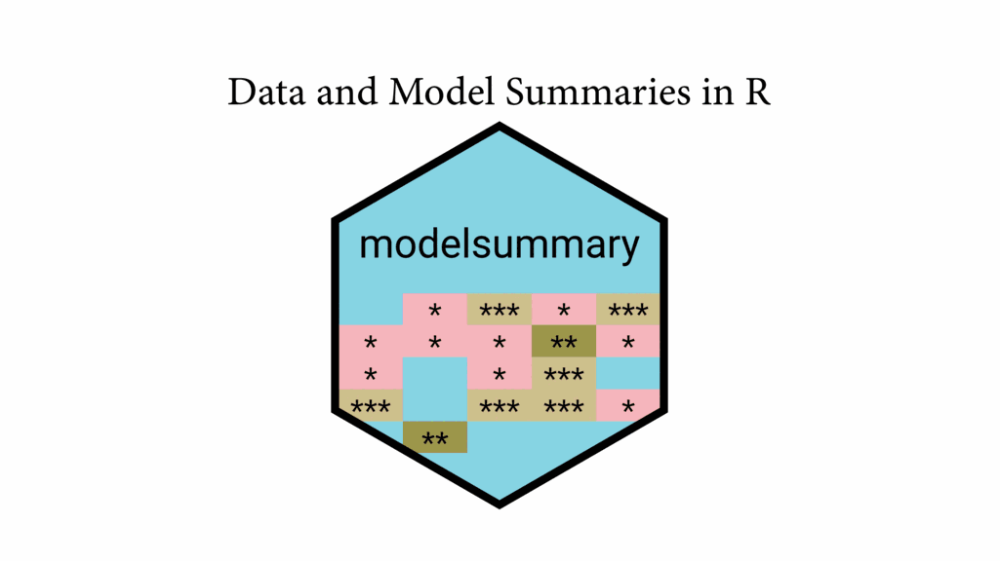

<p align="center">
<a href="https://modelsummary.com">

</a> <br> <br>
<a href = "https://github.com/vincentarelbundock/modelsummary/blob/main/LICENSE.md" target = "_blank"></a>
<a href = "https://modelsummary.com" target = "_blank"></a>
<a href = "https://modelsummary.com" target = "_blank"></a>
<br><br>
</p>

`modelsummary` creates tables and plots to present *descriptive
statistics* and to summarize *statistical models* in `R`.

> modelsummary is a package to summarize data and statistical models in
> R. It supports over one hundred types of models out-of-the-box, and
> allows users to report the results of those models side-by-side in a
> table, or in coefficient plots. It makes it easy to execute common
> tasks such as computing robust standard errors, adding significance
> stars, and manipulating coefficient and model labels. Beyond model
> summaries, the package also includes a suite of tools to produce
> highly flexible data summary tables, such as dataset overviews,
> correlation matrices, (multi-level) cross-tabulations, and balance
> tables (also known as “Table 1”). The appearance of the tables
> produced by modelsummary can be customized using external packages
> such as kableExtra, gt, flextable, or huxtable; the plots can be
> customized using ggplot2. Tables can be exported to many output
> formats, including HTML, LaTeX, Text/Markdown, Microsoft Word,
> Powerpoint, Excel, RTF, PDF, and image files. Tables and plots can be
> embedded seamlessly in rmarkdown, knitr, or Sweave dynamic documents.
> The modelsummary package is designed to be simple, robust, modular,
> and extensible [(Arel-Bundock,
> 2022)](https://doi.org/10.18637/jss.v103.i01).

## What?

`modelsummary` includes two families of functions:

1.  Model Summary
    -   `modelsummary`: Regression tables with side-by-side models.
    -   `modelplot`: Coefficient plots.
2.  Data Summary
    -   `datasummary`: Powerful tool to create (multi-level) cross-tabs
        and data summaries.
    -   `datasummary_crosstab`: Cross-tabulations.
    -   `datasummary_balance`: Balance tables with subgroup statistics
        and difference in means (aka “Table 1”).
    -   `datasummary_correlation`: Correlation tables.
    -   `datasummary_skim`: Quick overview (“skim”) of a dataset.
    -   `datasummary_df`: Turn dataframes into nice tables with titles,
        notes, etc.

## Why?

Here are a few benefits of `modelsummary` over some [alternative
packages](#alternative-packages):

#### Easy

`modelsummary` is very easy to use. This simple call often suffices:

``` r
library(modelsummary)

mod <- lm(y ~ x, dat)
```

The command above will automatically display a summary table in the
`Rstudio` Viewer or in a web browser. All you need is one word to change
the output format. For example, a text-only version of the table can be
printed to the Console by typing:

``` r
modelsummary(mod, output = "markdown")
```

Tables in Microsoft Word and LaTeX formats can be saved to file by
typing:

``` r
modelsummary(mod, output = "table.docx")
modelsummary(mod, output = "table.tex")
```

#### Flexible

*Information*: The package offers many intuitive and powerful utilities
to [customize the
information](https://modelsummary.com/articles/modelsummary.html)
reported in a summary table. You can rename, reorder, subset or omit
parameter estimates; choose the set of goodness-of-fit statistics to
include; display various “robust” standard errors or confidence
intervals; add titles, footnotes, or source notes; insert stars or
custom characters to indicate levels of statistical significance; or add
rows with supplemental information about your models.

*Appearance*: Thanks to the
[`tinytable`](https://vincentarelbundock.github.io/tinytable/),
[`gt`](https://gt.rstudio.com),
[`kableExtra`](https://haozhu233.github.io/kableExtra/),
[`huxtable`](https://hughjonesd.github.io/huxtable/),
[`flextable`](https://davidgohel.github.io/flextable/), and
[`DT`](https://rstudio.github.io/DT/) packages, the appearance of
`modelsummary` tables is endlessly customizable. The [appearance
customization page](https://modelsummary.com/articles/appearance.html)
shows tables with colored cells, weird text, spanning column labels, row
groups, titles, source notes, footnotes, significance stars, and more.
This only scratches the surface of possibilities.

*Supported models*: Thanks to the
[`broom`](https://broom.tidymodels.org/) and
[`parameters`](https://easystats.github.io/parameters/), `modelsummary`
supports *hundreds* of statistical models out-of-the-box. Installing
other packages can extend the capabilities further (e.g.,
[`broom.mixed`](https://CRAN.R-project.org/package=broom.mixed)). It is
also very easy to [add or customize your own
models.](https://modelsummary.com/articles/modelsummary.html#adding-new-models-1)

*Output formats*: `modelsummary` tables can be saved to HTML, LaTeX,
Text/Markdown, Microsoft Word, Powerpoint, RTF, JPG, or PNG formats.
They can also be inserted seamlessly in Rmarkdown documents to produce
[automated documents and reports in PDF, HTML, RTF, or Microsoft Word
formats.](https://modelsummary.com/articles/modelsummary.html#rmarkdown-and-knitr-1)

#### Dangerous

`modelsummary` is dangerous! It allows users to do stupid stuff like
[inserting squirrels in all your
tables.](https://modelsummary.com/articles/appearance.html#gt-1)


#### Reliable

`modelsummary` is *reliably* dangerous! The package is developed using a
[suite of unit
tests](https://github.com/vincentarelbundock/modelsummary/tree/main/inst/tinytest)
with about 95% coverage, so it (probably) won’t break.

#### Community

`modelsummary` does not try to do everything. Instead, it leverages the
incredible work of the `R` community. By building on top of the `broom`
and `parameters` packages, `modelsummary` already supports hundreds of
model types out-of-the-box. `modelsummary` also supports five of the
most popular table-building and customization packages: `gt`,
`kableExtra`, `huxtable`, `flextable`, and `DT` packages. By using those
packages, `modelsummary` allows users to produce beautiful, endlessly
customizable tables in a wide variety of formats, including HTML, PDF,
LaTeX, Markdown, and MS Word.

One benefit of this community-focused approach is that when external
packages improve, `modelsummary` improves as well. Another benefit is
that leveraging external packages allows `modelsummary` to have a
massively simplified codebase (relative to other similar packages). This
should improve long term code maintainability, and allow contributors to
participate through GitHub.

## How?

You can install `modelsummary` from CRAN:

``` r
install.packages('modelsummary')
```

You can install the development version of `modelsummary` and its
dependencies from R-Universe:

``` r
install.packages(
    c("modelsummary", "tinytable", "insight", "performance", "parameters"),
    repos = c(
        "https://vincentarelbundock.r-universe.dev",
        "https://easystats.r-universe.dev"))
```

**Restart `R` completely before moving on.**

## Get started

The [GET STARTED](https://modelsummary.com/vignettes/get_started.html)
vignette will walk you through the basics of `modelsummary`.

You will find that there are a million ways to customize the tables and
plots produced by `modelsummary`, but [the Get Started
page](https://modelsummary.com/vignettes/get_started.html) only
scratches the surface. For details, see the vignettes:

-   [Data
    Summaries](https://modelsummary.com/vignettes/datasummary.html)
-   [Model
    Summaries](https://modelsummary.com/vignettes/modelsummary.html)
-   [Model Plots](https://modelsummary.com/vignettes/modelplot.html)
-   [`modelsummary` extensions and
    customization](https://modelsummary.com/vignettes/modelsummary_extension.html)
-   [Themes and
    Styles](https://modelsummary.com/vignettes/appearance.html)
